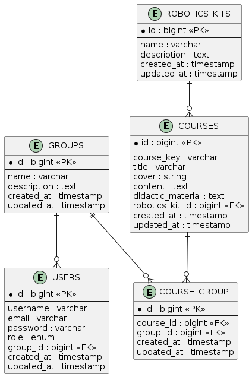

# Robotics School Database Project

## Project Description
This project consists of the design and implementation of a relational database for a robotics school platform using Laravel and Eloquent ORM. The system manages users, groups, robotics kits, and courses. It also includes seeders and factories to populate the database with sample and test data.

## ER Diagram
